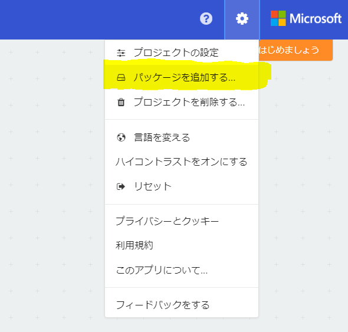
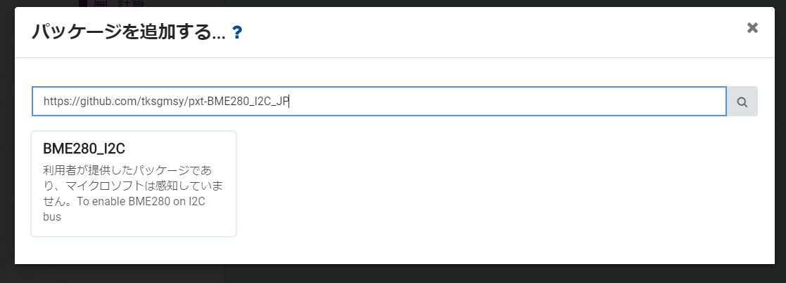
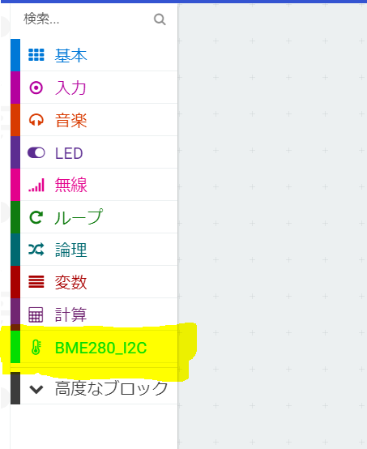
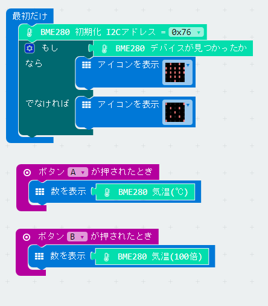

## おや？夏休みの自由研究かい？
いやー暑いね！元気に夏休みがんばっているかな？  
ん？ひょっとして君は、夏休みの自由研究に、BME280を使って、気温と気圧、そして湿度の測定をしようとしている小学生かな？  
すごい！がんばれ！きっとできる！下に書いてあることをよく読んでやってみよう！保護者の人にも一緒に最後まで読んでもらおう！    
よく読んでも、わからないことがあるときは、近くの人に聞いてみよう！その人が知らなくても、ほかに詳しそうな人をしっているかもしれない。きっと君の助けになると思うよ。だから一人で悩んじゃダメだ。  

## BME280とは？
BME280は、ドイツのBOSCHという会社が作った、気温と気圧、そして湿度を正確にはかるためのセンサーだ。しかも、マイコンとつながるためのインターフェースも持っている。これをマイクロビットにつなげば、BME280が正確な 気温と気圧、湿度を測って、マイクロビットに送ってくれるというわけだ。マイクロビットにも、温度計はついているんだけど、これは、あまり正確に気温を測ることができないんだ。（どうしてかっていうと、マイクロビットの温度計は、マイクロビットのCPUの温度を測るためについているのだ。気温を測るためについているんじゃないんだ。）  
もしも君が、英語もスラスラ読める、すごい小学生なら、以下のリンクにBME280のことがもっと詳しくかいてあるよ。  
https://www.bosch-sensortec.com/bst/products/all_products/bme280  

## さっそく準備しよう！
### これだけは絶対必要！
- パソコン  
MacでもWindowsでも大丈夫だよ。ただし、USBインターフェースがちゃんと使えること。
それから以下のホームページを開いて、ちゃんと表示されないと、マイクロビットのプログラミングができないよ。  
[https://makecode.microbit.org/](https://makecode.microbit.org/)  
もしも、マイクロビットを使ったことがないなら、はじめは簡単なプログラムをいくつか書いてみよう。  
マイクロビットを持ってなくても、このホームページで、プログラムを書いて、パソコンにダウンロードすることはできるぞ！まずは、何でもいいから、プログラムを書いて、パソコンに保存できるか確認しよう！  
やり方が分からなくても大丈夫！以下のホームページにやり方が書いてあるよ。
[http://microbit.org/ja/guide/quick/](http://microbit.org/ja/guide/quick/)

- マイクロビット  
持ってなかったら、買ってもらうしかない！  
はじめは、単四電池で動かせる電池ボックスのついたスターターキッドがおすすめだよ！  
[これは、売っていたお店（マルツ）のリンク](https://www.marutsu.co.jp/pc/i/839896/)  
  

- BME280 I2C ボード  
持ってなかったら、買ってもらうしかない！  
だけど、これが難しい。君のそばに、詳しい人がいてくれるといいんだけど...  
以下のリンクが、僕が使ったのと同じものが売っているお店のものだよ。  
[これは、売っていたお店（秋月電子通商）のリンク](http://akizukidenshi.com/catalog/g/gK-09421/)  
これ以外にも、インターネットで探すと、いろいろな種類のボードが見つかるよ。
BME280は、写真の真ん中に映っている、小さな四角形の部分だよ。これだけだとマイクロビットにつなげないから、必ず基盤についているやつを選んでね。あと、マイコンとの接続に、I2CとSPIという2種類があるんだけど、I2Cが使えるものを選んでね。  
ちなみに、僕が買ったボードは、コネクターがはんだ付けされてなかったから、大人の人に付けてもらったよ。はんだ付けはあぶないから、できる大人の人に頼もう！  
よくわからないときは、必ず詳しい人に聞いてから買ってもらおう。高くても1000円ぐらいで買えると思うよ。  
  

### もっていると、とても便利なもの！
- マイクロビット用のブレイクアウトボード  
ブレイクアウトボードは、マイクロビットを、後で説明するブレッドボードにつなぐ時にとても便利なものだよ。  
これは、マイクロビット用ならば、どんなブレイクアウトボードでも、ブレッドボードに接続できれば大丈夫！  
[これは、売っていたお店（マルツ）のリンク](https://www.marutsu.co.jp/pc/i/839840/)  
  

- ブレッドボードとジャンパー  
ブレッドボードは、どんなものでも大丈夫だけど、小さすぎると、ブレイクアウトボードが、接続できないかもしれないから気を付けよう。  
あまり安すぎるやつは、接触不良になったりするから、お店の人や詳しい人に、おすすめを聞いてみるのも良いと思うよ！  
ジャンパーは、どんなに多くても10本あれば、大丈夫だよ。  
  

### マイクロビットとBME280をつないでみよう！
マイクロビットとBME280 I2Cボードは、少なくとも4つの端子をつなぐ必要があるよ。まずは、"+3v3"と"GND"をつなぐよ。これは、マイクロビットから、BME280ボードに、電気をあげるためにつなぐんだ。ちょうど、電池のプラスとマイナスの役割をするところだよ。  
そのほかには、マイクロビットとBME280ボードが通信をするための端子をつなぐよ。名前は、"SCL"と"SDA"だよ。  
以下のリンクにマイクロビットのどの端子がどこにあるか全部書いてあるから、見てみてね。  
[マイクロビットの端子の説明](http://microbit.org/guide/hardware/pins/)  
ブレイクアウトボードを使ってるひとは、ブレイクアウトボードの基盤に書いてあるか、付属の説明書に書いてあるから確認しよう！  
そして、つなぐ相手のBME280ボードのほうは、みんなが使ってるボードが違うから、どこにつなげば良いかは、ここでは説明できないんだ。だけど、ほとんどのBME280ボードは、下のような名前の端子があると思うから、そこにつなげばきっとうまくいくと思うよ。だけど、使ってるBME280ボードによっては、これ以外の端子も、"GND"や"+3v3"につなぐ必要があるかもしれない。説明書をよく読んでみよう！そして、わからないときは、周りの人に聞いてみよう！  

1. マイクロビットの"+3v3"をBME280ボードの"VDD"に
2. マイクロビットの"GND"をBME280ボードの"GND"に
3. マイクロビットの"SDA"をBME280ボードの"SDI"に
4. マイクロビットの"SCL"をBME280ボードの"SCK"に

### せつぞくしてみたよ！
じゃあ、僕の場合を見てみよう。参考にしてね。  

1. まずは、マイクロビットをブレイクアウトボードにつなぐよ  
  
2. 次にブレイクアウトボードとブレッドボードをつなぐよ！  
  
3. そのあとに、BME280ボードをブレッドボードにつなぐよ。  
ブレッドボードは、真ん中の溝で、線が切れているから、マイクロビットの反対側に指すといいよ。一番はじの、+と-が書いてあるところには、ささないように注意してね。  
  
4. 最後にジャンパーを使って、さっき説明した通りに線をつなぐよ。写真の赤い線は、"+v3v"につないでいる線で、黒い線は、"GND"につないでいるよ。青い線が、”SCL"につながっていて、白い線が"SDA"につながってるよ。僕が使っているBME280ボードは、さっき説明した4つの線のほかに、2つつないでいるところがあるんだ。一つは、SPIとI2Cのうち、I2Cを使うことを伝えるためにつないでいる線と、もう一つは、I2Cのアドレスを0x76にするためにつないでいる線があるんだ。これはBME280ボードの説明書をよく読むと書いてあると思うよ。わからないときは、周りの人に聞いてみよう！  
  

### プログラミングしよう！
ふぅー。やっと接続できたね。うまく動くといいんだけど。。。ちょっと不安だね。でも次はプログラミングだよ。実際にBME280ボードから気温のデータを読んでみよう！  

1. まずは、パソコンンのブラウザで、[https://makecode.microbit.org](https://makecode.microbit.org) を開いてみよう。  
日本語になっていない場合は、右上のギアのアイコンをクリックして、"Language"をクリックしよう。出てきたウィンドウの中から日本語を選ぼう！  
2. 右上のギアのマークから、"パッケージを追加する..."  を選ぼう
  
3. 出てきたウィンドウに以下のURLを入力しよう。    
https://github.com/tksgmsy/pxt-BME280_I2C_JP  
BME280ボードを動かすためのブロックが入っている、パッケージを選んで追加しよう。  
  
4. うまくいったら、ブロックコーディングをするところにBME280_I2Cが追加されるとおもうよ。
  
5. 最後は、BME280ボードを使ったサンプルコードだよ  
  
ここで気を付けてほしいのは、"初期化"のブロックのI2Cのアドレスは、自分が使っているBME280ボードのアドレス（0x76か0x77)に合わせてね。これが違うと全然動かないよ。もしBME280ボードがマイクロビットから見て、ちゃんとつながっている時は、"デバイスが見つかったか?"ブロックが真を返すよ。ちゃんとつながってないときは、偽を返すよ。上のプログラムでは、"X"マークが出たらうまくつながっていないから、その時は、もう一度、配線を見直そう。  
"A"ボタンを押すと、今の気温が表示されるよ。  
"B"ボタンを押すと、今の気温の100倍の数字が表示されるよ。なぜ100倍かというと、マイクロビットは小数点を使うことができないんだ。だから、100倍の値を整数として表示してるんだ。たとえば、20.25度なら、2025と表示するんだ。

6. うまくいったかな？  
どうだろう？うまくいったかな？うまくいった人はすごい！ほかにもこんなことが出来るよ！  
- 気圧や湿度も測れるから測ってみよう。  
- 湿度を連続で測りながら、センサーに息を吹きかけてみよう。湿度がすぐに上昇するのが分かると思うよ。  
- 一日中、気圧を測ってみるのも面白いよ。特に雨や台風が来てるときは面白いかもしれないよ。  
- マイクロビットのタイマー機能を使って、何分かおきに、自動で測って、あとでボタンを押したら表示するプログラムなんかにも挑戦してみよう。  
それじゃあがんばってね！  
  
### スーパー小学生へ。  
このパッケージには、ここで説明していない、いろいろな機能を設定するためのブロックが入ってるよ。でもそれを使うためには、BME280のことを、もっと詳しく知らないと、うまく使えないよ。くわしくは以下のURLを見て、データシートをダウンロードして読んでみてね。英語だよ。
https://www.bosch-sensortec.com/bst/products/all_products/bme280

### 最後に。保護者の方へ。  
これは、夏休みの自由研究として、部材の調達に始まり、簡単な電子工作を経て、プログラミングというように、うまくいけばとても楽しいですが、小学生、特に低学年には難しい内容となっています。高学年でも、普段からPCやマイクロビットなどのマイコンを触っていないと、お子様だけで全部成し遂げるのは難しいと思います。分からないところは、ぜひとも、保護者の方が手伝ってあげていただければと思います。しかし、保護者の方も、普段から、この手の分野に親しまれている方々でないと、適切なアドバイスをするのは難しいと思います。その場合は、お近くのお知り合いの方に、ご助力いただければと思います。それも難しい場合は、お子様が失敗しても、どうが決して怒らないでください。失敗したことは必ず次につながります。  
うまくいかないときは、何が原因かなどは、簡単にわかるものではありません。必ずうまくいかないといけない自由研究として行う場合は、絶対の自信のあるお子様か、必ずトラブルシューティングできる大人がそばにいる場合を除いてはお勧めしません。  
それでも、失敗しても、その失敗を自分の自由研究として発表できるお子様や、そこから臨機応変にテーマを変えて自分の研究として進めることのできるお子様には、このページが良いきっかけになれば幸いかと思います。
